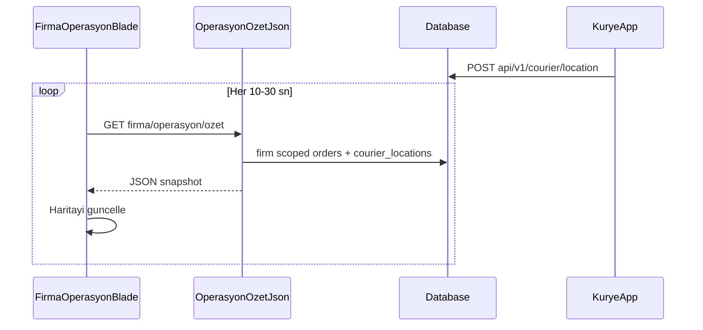

# EPIC-10A — Canlı operasyon ekranı (tasarım notları)

İlgili epic: [ROADMAP_EPICS.md](ROADMAP_EPICS.md) → EPIC-10A.

## 1. Amaç ve kapsam (MVP)

Firma yöneticisi tek ekranda:

- Aktif siparişleri (durum + restoran + müşteri özeti) görsün.
- Firma kuryelerinin son bilinen konumunu haritada görsün.
- Bir siparişe kurye atansın veya atama değiştirilsin (mevcut `assignCourier` akışı ile uyumlu).

**Kapsam dışı (sonraki sprint):** rota optimizasyonu, batch teslimat, ısı haritası, agregatör kanal filtreleri (veri modeli hazırlanabilir, UI sonra).

## 2. Mevcut kod tabanı (kullanılacak parçalar)

| Bileşen | Dosya / rota |
|--------|----------------|
| Sipariş listesi / filtre | `Firm\OrderController@index`, `routes/web.php` `firma/siparisler` |
| Kurye atama | `Firm\OrderController@assignCourier`, `POST firma/siparisler/{order}/kurye` |
| Sipariş detay (adres) | `Order` → `deliveryAddress` (`latitude`, `longitude`) |
| Kurye son konum | `CourierLocation` (`courier_id`, `latitude`, `longitude`, `updated_at`) |
| Mobil konum gönderimi | `POST api/v1/courier/location` (Sanctum, kurye kullanıcısı) |

## 3. Veri ihtiyaçları

### 3.1 Haritada sipariş pini

- **Kaynak:** `orders.delivery_address_id` → `addresses.latitude`, `addresses.longitude`.
- **Eksikse:** adres satırı var ama koordinat yok → pin gösterilemez; listede uyarı (“koordinat yok”) veya geocoding job (Faz 1.5).

### 3.2 Haritada kurye pini

- **Kaynak:** `courier_locations` (tek satır / kurye, `updateOrCreate`).
- **Tazelik:** `updated_at` üzerinden “X dakikadan eski” gri/uyarı.

### 3.3 İsteğe bağlı şema genişletmeleri (ileri)

- `couriers`: `last_seen_at`, `is_online` (mobil heartbeat).
- `orders`: `channel` (manuel, magaza, agregatör) — referans menüdeki “sipariş kanalı” filtreleri için.
- `delivery_zones` + polygon — bölge bazlı dispatch (EPIC-10B ile birlikte).

## 4. API / rota stratejisi

İki geçerli seçenek; MVP için A önerilir.

### A) Sunucu render + hafif JSON poll (önerilen MVP)

- `GET firma/operasyon` → Blade + harita JS.
- `GET firma/operasyon/ozet` → JSON: `{ couriers: [...], orders: [...] }` (sadece `firm_id` scope, throttle).
- Avantaj: Mevcut `firm.auth` ile aynı oturum; mobil API’ye dokunmadan panel hızlı ayağa kalkar.

### B) Tam JSON API (v1 genişletmesi)

- `GET api/v1/firm/operations/snapshot` (Sanctum + firma admin rolü).
- İleri entegrasyon ve üçüncü parti dashboard için uygun.

**Ortak kurallar**

- Tüm sorgular `where('firm_id', auth()->user()->firm_id)` (veya eşdeğeri).
- Kurye listesi: yalnızca `couriers.firm_id = ...`.
- Sipariş listesi: yalnızca `orders.firm_id = ...` ve isteğe bağlı `status in (...)`.

## 5. Önerilen JSON snapshot şekli (MVP)

```json
{
  "generated_at": "2026-04-10T12:00:00+03:00",
  "couriers": [
    {
      "id": 1,
      "name": "Ali",
      "status": "active",
      "lat": 41.0,
      "lng": 29.0,
      "location_updated_at": "2026-04-10T11:58:00+03:00"
    }
  ],
  "orders": [
    {
      "id": 42,
      "status": "ready",
      "restaurant": { "id": 3, "name": "X" },
      "courier_id": null,
      "delivery": {
        "lat": 41.01,
        "lng": 29.01,
        "has_coordinates": true
      }
    }
  ]
}
```

**Hassas veri:** MVP’de müşteri adı/telefon snapshot’ta opsiyonel veya maskeleme; haritada yalnızca sipariş id + durum yeterli olabilir.

## 6. Arayüz (wireframe — metin)

```
┌─────────────────────────────────────────────────────────────────┐
│ Firma ▸ Operasyon                                    [Yenile] [?] │
├──────────────────────────────┬──────────────────────────────────┤
│ Sol: Sipariş havuzu (tablo)   │ Sağ: Harita                      │
│ Filtre: durum, restoran       │  • Restoran pinleri (opsiyonel)  │
│ Arama: #id                    │  • Teslimat pinleri               │
│ Satır tıkla → haritada zoom   │  • Kurye pinleri + son güncelleme │
│ [Kurye ata ▼] [Detay]         │                                  │
└──────────────────────────────┴──────────────────────────────────┘
```

**Etkileşim:** Tablo satırı seçildiğinde harita ilgili teslimat pinine odaklanır. “Kurye ata” mevcut form POST ile aynı endpoint’i kullanır (CSRF + redirect veya fetch + toast).

## 7. Harita sağlayıcısı

- **Seçim:** Mapbox / Google Maps / Leaflet + OSM (bütçe ve KVKK metni [PLATFORM_MIMARI_VE_REKABET.md](PLATFORM_MIMARI_VE_REKABET.md) checklist ile).
- **Gizlilik:** Müşteri tarafına açık takip (EPIC-10C) bu ekrandan ayrı token ile yapılmalı.

### 7.1 Yakın kurye / GEO indeksi (opsiyonel)

`POST api/v1/courier/location` çağrıları `courier_locations` tablosuna yazılır. İsteğe bağlı olarak Redis `GEOADD` ile de indekslenir: `.env` içinde `COURIER_GEO_REDIS=true` ([config/courier.php](../config/courier.php)). Anahtar **firma bazlıdır**: `{prefix}:{firm_id}`. Redis hata verirse istek yine başarılı kalır; uyarı loglanır.

**Firma paneli:** `GET firma/operasyon` (sayfa: tablo + Leaflet/OSM harita + kurye atama / değiştirme; harita pinleri ↔ tablo satırı vurgulama / satırdan haritaya odaklanma), `GET firma/operasyon/ozet` (JSON özet; hazır+kuryesiz siparişlerde `suggested_nearby_courier_ids`). JSON’da restoran `lat`/`lng` haritada yeşil pin için verilir. **Kurye değiştirme:** `courier_assigned` / `picked_up` / `on_the_way` durumlarında `Firm\OrderController@assignCourier` durumu geri almadan `OrderStateService::recordCourierReassignment` ile geçmiş + bildirim.

## 8. Akış (MVP)



## 9. Test / kabul kontrol listesi

- [ ] Başka firmanın siparişi veya kuryesi snapshot’ta görünmüyor.
- [ ] Koordinatsız adreslerde sipariş listede var, haritada güvenli fallback.
- [ ] Atama sonrası sipariş durumu `OrderStateService` ile tutarlı (`CourierAssigned`).
- [ ] Konum 15+ dk eskiyse görsel uyarı (eşik konfigüre edilebilir).

## 10. Sonraki adımlar (kod)

1. `routes/web.php` + `Firm\OperationsController` (veya mevcut `DashboardController` genişletmesi).
2. Policy veya controller içi `firm_id` kontrolü (mevcut `OrderController` ile aynı desen).
3. Blade + Vite’te küçük bir harita modülü; env ile API anahtarı.
4. İsteğe bağlı: `php artisan test` ile feature test (JSON endpoint scope).

## 11. İlgili sonraki epikler

- [EPIC_10B_DISPATCH_V1.md](EPIC_10B_DISPATCH_V1.md) — otomatik atama
- [EPIC_10C_MUSTERI_TAKIP.md](EPIC_10C_MUSTERI_TAKIP.md) — müşteri takip sayfası
