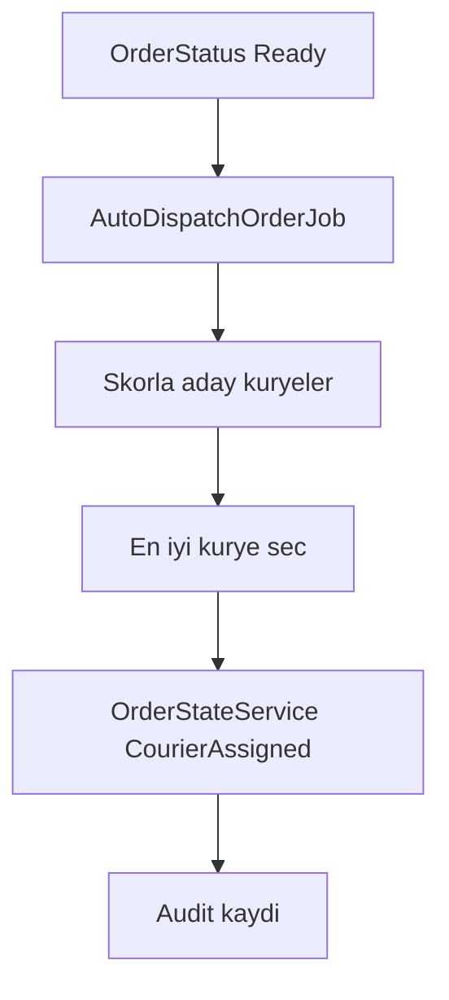

# EPIC-10B — Skor tabanlı otomatik kurye atama (tasarım notları)

İlgili epic: [ROADMAP_EPICS.md](ROADMAP_EPICS.md) → EPIC-10B.  
Bağımlılık: [EPIC_10A_OPERASYON_EKRANI.md](EPIC_10A_OPERASYON_EKRANI.md) (operasyon ekranı ile aynı veri varsayımları).

## 1. Amaç ve kapsam (MVP)

Restoran siparişi **hazır** olduğunda veya firma panelinden tetiklenince, uygun kuryeye **otomatik atama** yapılsın.

**MVP kapsamı**

- Tek sipariş — tek kurye (batch/rota yok).
- Skor: mesafe + aktif yük cezası + (isteğe bağlı) konum tazeliği.
- Atama sonucu mevcut `OrderStateService::transition(..., CourierAssigned)` ile aynı olsun.
- Karar **loglansın** (audit); mümkünse geri alınabilir manuel atama ile.

**Kapsam dışı (v2+)**

- Çoklu durak, rota sıralama, ısı haritası, bölge polygon (`delivery_zones`), dinamik ücret.

## 2. Mevcut kod tabanı

| Bileşen | Not |
|--------|-----|
| Manuel atama | `Firm\OrderController@assignCourier` → `OrderStateService::transition(..., CourierAssigned)` |
| Restoran koordinat | `Restaurant` → `latitude`, `longitude` |
| Teslimat koordinat | `Address` (sipariş `deliveryAddress`) |
| Kurye konum | `CourierLocation` |
| Kurye aktif sipariş | `Order::where('courier_id', ...)` + durum filtresi |

**Tetik noktası adayı:** Restoran `ready` geçişi (`Restaurant\OrderController@ready`) veya merkezi `OrderStateService` içinde duruma göre job dispatch (tercihen tek yer).

## 3. İş kuralları (v1)

### 3.1 Ne zaman çalışır?

- **Otomatik (varsayılan):** `OrderStatus::Ready` ve `courier_id` boş ve firma ayarında “otomatik atama açık”.
- **Manuel:** Firma operasyon ekranında “Otomatik ata” butonu (aynı servis çağrılır).

### 3.2 Önkoşullar

- `order.firm_id` sabit.
- Aday kuryeler: `couriers.firm_id = order.firm_id`, `couriers.status = active`.
- **Konum:** Adayın `courier_locations` kaydı ve `updated_at` ≤ N dakika (ör. 15); yoksa düşük öncelik veya dışlama (konfigüre).

### 3.3 Skor fonksiyonu (öneri)

Pickup noktası: `restaurant.latitude/longitude` (yoksa atama yapılamaz veya sadece “yük” skoruna düşülür — MVP’de tercihen **atama iptal + log**).

```
score = w1 * distance_km(restaurant, courier)
      + w2 * active_delivery_count(courier)
      + w3 * stale_location_penalty(minutes_since_update)
```

- `distance_km`: Haversine (PHP’de saf matematik veya mevcut yardımcı).
- `active_delivery_count`: `orders` where `courier_id` ve `status` ∈ {`courier_assigned`, `picked_up`, `on_the_way`} (veya firma politikasına göre genişletilir).
- En düşük skor kazanır.

**Eşitlik:** Düşük `courier.id` veya round-robin (firma bazlı sayaç — v2).

### 3.4 Başarısızlık

- Aday yok → log + (isteğe bağlı) firma admin’e bildirim.
- Restoran koordinatı yok → atama yapılmaz; “koordinat eksik” uyarısı.

## 4. Veri modeli — audit (önerilen migration)

`order_dispatch_decisions` (veya `assignment_logs`):

| Alan | Açıklama |
|------|-----------|
| `order_id` | FK |
| `firm_id` | Denormalize (sorgu kolaylığı) |
| `chosen_courier_id` | nullable |
| `candidates_json` | skor breakdown (id, score, distance_km, active_count) |
| `trigger` | `auto_ready` \| `manual_ui` \| `api` |
| `created_by_user_id` | nullable (manuel ise) |
| `created_at` | |

Benzersiz index gerekmez; bir siparişte birden fazla deneme olabilir.

## 5. Uygulama parçaları

1. **`App\Modules\Orders\Services\AutoDispatchService`** (veya `Dispatch\ScoringDispatcher`)
   - `dispatch(Order $order, string $trigger, ?User $actor): Result`
2. **`AutoDispatchOrderJob`** — kuyrukta çalışsın; restoran `ready` sonrası dispatch.
3. **Firma ayarı:** `firms` veya `firm_settings` JSON: `auto_dispatch_enabled`, `max_active_orders_per_courier`, `location_max_age_minutes`, `weights` (v2).
4. **Test:** Fake koordinatlarla birim test; feature test ile başka firma kuryesinin seçilmediği doğrulanır.

## 6. Güvenlik

- Sadece firma bağlamı; job içinde `order->firm_id` tekrar doğrulanır.
- Race: aynı siparişe eşzamanlı atama → DB transaction + `lockForUpdate()` veya `courier_id` null kontrolü yeniden okuma.

## 7. Kabul kontrol listesi

- [ ] `Ready` + boş kurye + ayar açık → job sonunda `CourierAssigned` ve `courier_id` dolu.
- [ ] Manuel “Otomatik ata” aynı sonucu üretir.
- [ ] Audit satırı yazılır; aday listesi JSON’da saklanır.
- [ ] Başka firmanın kuryesi asla atanamaz.

## 8. Akış


