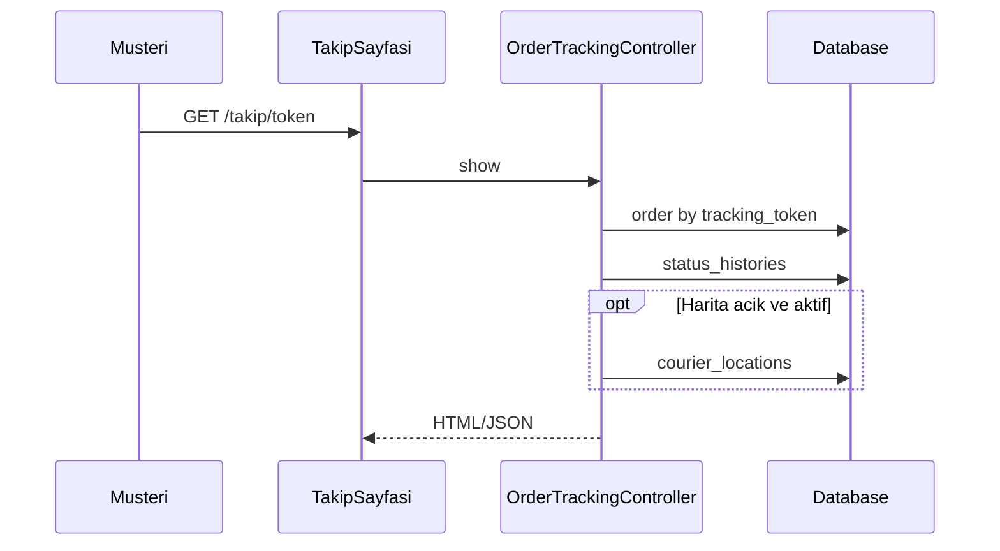

# EPIC-10C — Müşteri teslim takip linki (tasarım notları)

İlgili epic: [ROADMAP_EPICS.md](ROADMAP_EPICS.md) → EPIC-10C.

## 1. Amaç ve kapsam (MVP)

Müşteriye **giriş yapmadan** açılabilen bir link ile:

- Siparişin güncel durumunu (metin + basit zaman çizelgesi) göstermek.
- İsteğe bağlı: haritada **yaklaşık** kurye konumu veya gecikmeli konum (KVKK).

**Kapsam dışı (v2+)**

- Canlı sohbet, sipariş düzenleme, push bildirim (ayrı kanal).

## 2. Tehdit modeli ve KVKK

- Link **tahmin edilemez** token ile çalışmalı (UUID v4 veya `Str::random(48)` + unique index).
- URL’de sipariş id düz metin olmamalı (enumeration riski).
- Kamu sayfasında:
  - Tam adres, telefon, ad-soyad gösterimi **varsayılan kapalı** veya maskeleme (`Ah***`, son 4 hane).
  - Açık rıza metni / bilgilendirme footer’da (ürün hukuku onayı).
- **Konum:** “Tam pın” yerine şehir/ilçe seviyesi veya 200–500 m grid snap; veya konumu teslimat `on_the_way` sonrası göster.

## 3. Veri modeli (önerilen migration)

`orders` tablosuna:

| Alan | Açıklama |
|------|-----------|
| `tracking_token` | `string(64)` unique nullable |
| `tracking_token_created_at` | datetime nullable |
| `tracking_revoked_at` | datetime nullable (iptal / teslim sonrası kapatma) |

Alternatif: ayrı `order_tracking_tokens` tablosu (çoklu token, rotasyon) — SaaS için daha temiz.

**Teslim / iptal sonrası:** Token geçersiz kılınabilir veya salt-okunur “özet” gösterilir (ürün kararı).

## 4. Rotalar

- `GET /takip/{token}` — `web` middleware, **auth yok**.
- Controller: `App\Http\Controllers\Public\OrderTrackingController@show`
- View: minimal layout (firma adı / logo `FirmContext` olmadan — `order.firm` üzerinden).

**Rate limit:** `throttle` ile IP başına (ör. 60/dk) — brute force azaltma.

## 5. Gösterilecek veri

**Her zaman**

- Durum: `OrderStatus::label()` ve son güncelleme zamanı (sipariş veya son history).
- Basit timeline: `order_status_histories` sıralı, `created_at` + durum etiketi (meta içindeki hassas alanlar strip).

**Koşullu**

- Kurye adı: kapalı veya sadece “Kuryeniz yolda”.
- Harita: yalnızca token geçerli + sipariş aktif + firma ayarı açık.

**Kurye konumu kaynağı:** `CourierLocation` + sipariş `courier_id` eşleşmesi; başka siparişin kuryesi gösterilmez.

## 6. Token üretimi ve dağıtım

- Sipariş oluşturulunca veya `CourierAssigned` sonrası token üret (ürün kararı).
- Müşteriye: SMS şablonu / WhatsApp / e-posta (EPIC faz 2 bildirim omurgası).
- Mağaza sipariş onayı sayfasında “Takip linkini kopyala” (auth’lu müşteri için).

## 7. Test / kabul kontrol listesi

- [ ] Geçersiz token → 404 (bilgi sızdırmadan).
- [ ] Başka siparişin history’si veya kurye konumu görünmez.
- [ ] İptal / teslim sonrası davranış dokümana uygun.
- [ ] Rate limit aşımında anlamlı yanıt.

## 8. Akış

## 9. İlişkili dosyalar (uygulama sırasında)

- `routes/web.php` — public rota grubu
- Yeni controller + policy yok (public); yetki kontrolü token ile
- `OrderStateService` — teslim/iptal sonrası token revoke (isteğe bağlı hook)
