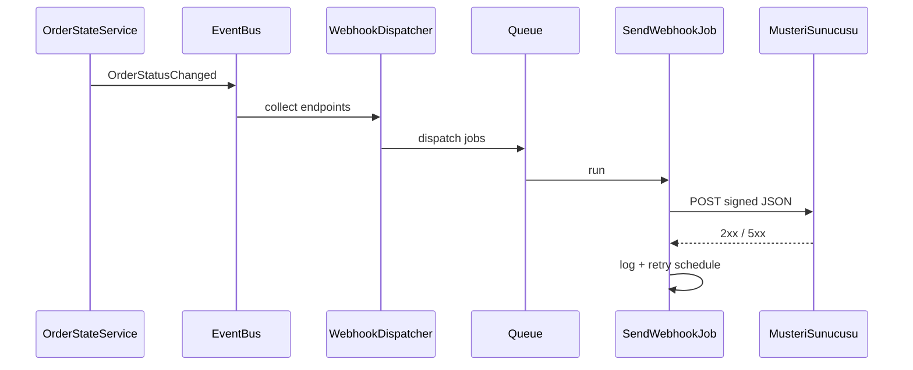

# EPIC-20A — Giden webhook sistemi (tasarım notları)

İlgili epic: [ROADMAP_EPICS.md](ROADMAP_EPICS.md) → EPIC-20A.

## 1. Amaç

Firma veya entegrasyon ortağı, kendi sisteminde sipariş olaylarını **HTTP callback** ile alsın.

**MVP olayları**

| Event | Tetik (öneri) |
|-------|----------------|
| `order.created` | Sipariş DB’ye yazıldıktan sonra (mağaza checkout vb.) |
| `order.status_changed` | `OrderStateService::transition` başarılı commit sonrası |
| `order.cancelled` | `status === cancelled` olan geçiş (ayrı event veya `status_changed` içinde `to: cancelled`) |

Ürün kararı: tek `order.status_changed` yeterli ise `order.cancelled` ayrılmayabilir; dokümante edilmeli.

## 2. Abonelik modeli (önerilen şema)

### `webhook_endpoints`

| Alan | Açıklama |
|------|-----------|
| `id` | PK |
| `firm_id` | FK |
| `url` | HTTPS zorunlu (MVP) |
| `secret` | HMAC imza anahtarı (şifreli saklama veya hash) |
| `events` | JSON array: `["order.created", ...]` |
| `is_active` | bool |
| `created_at` / `updated_at` | |

### `webhook_deliveries`

| Alan | Açıklama |
|------|-----------|
| `id` | PK |
| `webhook_endpoint_id` | FK |
| `event_type` | string |
| `idempotency_key` | string unique (retry için aynı gövde) |
| `payload_json` | gönderilen gövde |
| `status` | `pending` / `delivered` / `failed` |
| `attempt_count` | int |
| `last_http_status` | nullable |
| `last_error` | text nullable |
| `next_retry_at` | nullable |
| `created_at` / `updated_at` | |

**İdempotency key önerisi:** `{event_type}:{order_id}:{transition_id}` — transition için `order_status_histories.id` veya `order_id + new_status + created_at` hash.

## 3. Payload sözleşmesi (v1)

Tüm istekler `POST`, `Content-Type: application/json`.

```json
{
  "event": "order.status_changed",
  "api_version": "2026-04-10",
  "sent_at": "2026-04-10T12:00:00+03:00",
  "data": {
    "order_id": 42,
    "firm_id": 1,
    "from_status": "ready",
    "to_status": "courier_assigned",
    "order": {
      "id": 42,
      "status": "courier_assigned",
      "restaurant_id": 3,
      "courier_id": 7,
      "total_price": "120.00"
    }
  }
}
```

**Hassas veri:** MVP’de müşteri PII gönderilmez veya firma ayarına bağlı `include_customer` flag (varsayılan kapalı).

## 4. İmza (HMAC)

- Header: `X-Webhook-Signature: sha256=<hex>` veya `X-Hub-Signature-256` (GitHub uyumlu).
- Gövde: ham JSON string (canonical serialization — Laravel `json_encode` sırası sabit).
- Alıcı doğrulama: `hash_equals(hash_hmac('sha256', rawBody, secret), ...)`.

## 5. Teslimat ve retry

- İlk gönderim: sync değil; **`SendWebhookJob`** kuyrukta.
- Başarı: HTTP 2xx.
- Retry: exponential backoff (örn. 1m, 5m, 30m, 2h, 24h); max deneme sayısı (örn. 8).
- Başarısız endpoint: `is_active` düşürme veya sadece uyarı (ürün kararı).

## 6. Laravel entegrasyonu

1. `OrderStateService` sonunda `event(new OrderStatusChanged(...))` veya doğrudan `WebhookDispatcher::dispatchForOrder(...)`.
2. `order.created` için sipariş oluşturan servis/controller tek çıkış noktasından tetikleme (ör. `ShopController@checkout` sonrası).
3. Admin/firma UI: endpoint CRUD (Faz 2.5).

## 7. Güvenlik

- URL doğrulama: sadece `https`, opsiyonel allowlist domain.
- SSRF: iç IP’lere istek engeli (özel HTTP client veya güvenlik katmanı).
- Rate: alıcı tarafında değil; gönderen tarafında job concurrency limiti.

## 8. Kabul kontrol listesi

- [ ] `order.status_changed` her geçişte en fazla bir idempotency ile gidiyor (retry hariç aynı key tekrarlanmıyor).
- [ ] İmza doğrulanmadan işlem yapılmıyor (alıcı dokümantasyonu).
- [ ] Teslimat logları firma bazlı sorgulanabiliyor.
- [ ] Başka firmanın siparişi asla yanlış endpoint’e gitmiyor.

## 9. Akış



## 10. İlgili

- [EPIC_20B_AGGREGATOR_PILOT.md](EPIC_20B_AGGREGATOR_PILOT.md) — dış kanaldan gelen siparişler ve durum geri yazma
