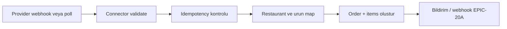

# EPIC-20B — Agregatör / POS pilot entegrasyonu (tasarım notları)

İlgili epic: [ROADMAP_EPICS.md](ROADMAP_EPICS.md) → EPIC-20B.  
İlgili: [EPIC_20A_WEBHOOKS.md](EPIC_20A_WEBHOOKS.md) (durum değişince dışarı bildirim).

## 1. Amaç (pilot)

Tek bir kanal seçilerek (ör. Trendyol Yemek / Yemeksepeti / GetirYemek — **ürün kararı**) uçtan uca akış:

1. Dışarıdan gelen sipariş → iç `orders` + `order_items`.
2. İç durum değişimi → agregatöre geri yazma (API veya webhook kabulü — kanala göre).

Bu belge kanal-agnostik **kalıp** tanımlar; gerçek URL ve alanlar kanal dokümantasyonuna bağlanır.

## 2. Kavramlar

| Kavram | Açıklama |
|--------|-----------|
| **Connector** | Tek kanal için adapter sınıfı (ingest + outbound). |
| **External ID** | Agregatör sipariş kimliği (string). |
| **Mapping** | `restaurant_id` ↔ platform restoran id; ürün id eşlemesi (pilot’ta manuel tablo veya JSON). |

## 3. Veri modeli (önerilen)

### `integration_connections`

Firma başına kanal kimlik bilgisi (şifreli token, mağaza id).

| Alan | Örnek |
|------|--------|
| `firm_id` | FK |
| `provider` | `trendyol_yemek` |
| `credentials_encrypted` | text |
| `settings_json` | endpoint override, test mode |
| `is_active` | bool |

### `integration_external_orders`

İdempotent ingest ve eşleme.

| Alan | Açıklama |
|------|-----------|
| `firm_id` | FK |
| `provider` | string |
| `external_order_id` | unique composite (`firm_id`, `provider`, `external_order_id`) |
| `order_id` | nullable FK → `orders` (oluşturulunca dolu) |
| `last_payload_hash` | değişiklik dedup |
| `status` | `received` / `mapped` / `order_created` / `error` |
| `error_message` | nullable |

### Ürün eşlemesi (pilot)

- Basit tablo `integration_product_maps`: `firm_id`, `provider`, `external_product_id`, `local_product_id`  
- Veya pilot’ta tek restoran + manuel “varsayılan ürün” ile sınırlandırma.

## 4. Ingest akışı

**Giriş noktaları (birini seç)**

- **A)** `POST /api/integrations/{provider}/webhook` — provider imzası doğrulama.
- **B)** Zamanlanmış job: `PollAggregatorOrdersJob` (rate limit’e dikkat).

**Idempotency:** `external_order_id` zaten varsa yeni sipariş oluşturma; güncelleme (iptal, not) ayrı use-case.

## 5. Outbound (durum senkronu)

Tetik: `OrderStateService` sonrası veya `order.status_changed` webhook ile paralel `Connector::pushStatus($order, $toStatus)`.

**Hata yönetimi:** Kuyruk job + retry; başarısızlıkta `integration_external_orders` veya ayrı `integration_sync_logs` tablosu.

## 6. İç sipariş ile hizalama

- `orders.firm_id` / `restaurant_id` zorunlu.
- `payment_method`, `notes`, `total_price` provider alanlarından map.
- **Kanal alanı:** Gelecekte `orders.channel` veya `meta` JSON (EPIC-10A notu ile uyumlu).
- Müşteri: mevcut `User` oluşturma veya “misafir” kullanıcı politikası (KVKK + tekil telefon).

## 7. Güvenlik

- Webhook: sağlayıcı imzası / paylaşılan secret.
- Tokenlar: `credentials_encrypted` + rotation.
- Her istekte `firm_id` scope; connector içinde asla “ilk firma” fallback yok.

## 8. Pilot kabul kriterleri

- [ ] Aynı `external_order_id` iki kez gelince tek `orders` kaydı (veya bilinçli güncelleme kuralı).
- [ ] En az bir iç durum değişimi agregatöre yansıyor (ör. hazır / yolda / teslim).
- [ ] Hata durumunda operatör logdan nedeni görebilir.
- [ ] Başka firmanın bağlantısı kullanılamaz.

## 9. Uygulama sırası (öneri)

1. `integration_connections` + firma ayar ekranı (token).
2. `integration_external_orders` + tek connector stub (fake provider test).
3. Gerçek provider pilot + mapping UI minimum.
4. Outbound job + izleme.
