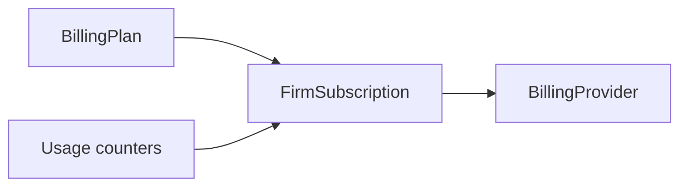

# EPIC-30A — Abonelik ve faturalama (SaaS tasarım notları)

İlgili epic: [ROADMAP_EPICS.md](ROADMAP_EPICS.md) → EPIC-30A.  
İlgili: [EPIC_30B_BI_EXPORT.md](EPIC_30B_BI_EXPORT.md) (kullanım metrikleri raporlarla birleşir).

## 1. Amaç

Firmalar için **paket + limit + tahsilat** modeli; referans üründeki **Cari Hesap / Kontör Yükle** ihtiyacını karşılayacak altyapı.

**İki gelir modeli (ürün kararı — ikisi veya biri)**

| Model | Açıklama |
|-------|-----------|
| **Abonelik** | Aylık/yıllık plan; kurye / restoran / sipariş kotası. |
| **Kontör (ön ödemeli)** | Bakiye veya paket kontör; işlem başı düşüm (sipariş, SMS vb.). |

MVP’de tek model seçmek riski düşürür; ikinci model sonra eklenir.

## 2. Plan ve limitler (önerilen şema)

### `billing_plans`

| Alan | Örnek |
|------|--------|
| `code` | `starter`, `growth` |
| `name` | Görünen ad |
| `price_cents` | Aylık fiyat (TRY) |
| `interval` | `month` / `year` |
| `limits_json` | `{ "max_active_couriers": 20, "max_restaurants": 5, "max_orders_per_month": 5000 }` |
| `features_json` | opsiyonel bayraklar (webhook, agregatör) |

### `firm_subscriptions`

| Alan | Açıklama |
|------|-----------|
| `firm_id` | FK |
| `billing_plan_id` | FK |
| `status` | `trialing` / `active` / `past_due` / `canceled` |
| `current_period_start` / `current_period_end` | |
| `external_customer_id` | Ödeme sağlayıcı müşteri id |
| `external_subscription_id` | Sağlayıcı abonelik id |

### `firm_usage_periods` (veya aylık aggregate)

| Alan | Açıklama |
|------|-----------|
| `firm_id` | |
| `period` | `2026-04` |
| `orders_created_count` | sayaç |
| `sms_sent_count` | vb. |

Sayaçlar: günlük job veya kritik aksiyonda increment (idempotent).

## 3. Limit uygulaması (middleware / policy)

- **Nerede:** Yeni kurye oluşturma, yeni restoran, sipariş oluşturma (isteğe bağlı sadece “dış” kanal).
- **Davranış:** Limit aşımında `402` veya yumuşak uyarı + admin onayı (ürün kararı).
- **Öncelik:** Tutarlı mesaj ve log (`limit_exceeded`).

## 4. Ödeme sağlayıcısı

- Mevcut kod: `PaymentGatewayInterface` + `NullPaymentGateway` — faturalama için benzer **`BillingProviderInterface`** düşünülebilir veya aynı aile.
- Türkiye için yaygın: **iyzico**; global alternatif: Stripe (TR uyumu ayrı değerlendirme).
- **Webhook’lar:** ödeme başarılı/başarısız, abonelik yenileme — imza doğrulama ve idempotency.

## 5. Kontör (ön ödemeli) — ek tablolar (v1.5)

- `firm_ledger_entries`: `type` (topup, debit), `amount_cents`, `reference`, `created_at`
- `firm_balances`: `balance_cents` (veya ledger’dan türetilmiş)
- “Kontör Yükle” akışı: ödeme → ledger `topup`

## 6. Admin ve firma UI

- **Admin:** plan CRUD, firma aboneliği atama, manuel süre uzatma.
- **Firma:** plan yükseltme, fatura geçmişi (PDF link), kullanım özeti (EPIC-30B ile paylaşılır).

## 7. KVKK ve muhasebe

- Fatura bilgileri (ünvan, VKN) firma profilinde; ayrı `billing_details` tablosu.
- e-Fatura entegrasyonu ayrı epic (strateji belgesi maddesi).

## 8. Kabul kontrol listesi

- [ ] Plan limiti aşıldığında beklenen davranış (blok / uyarı) tanımlı ve testli.
- [ ] Abonelik durumu `past_due` iken kritik işlemler kısıtlanıyor (veya grace period).
- [ ] Ödeme webhook’ları çift işlenmiyor (idempotency).
- [ ] Bir firmanın başka firmanın aboneliğine erişimi yok.

## 9. Akış (abonelik özet)

