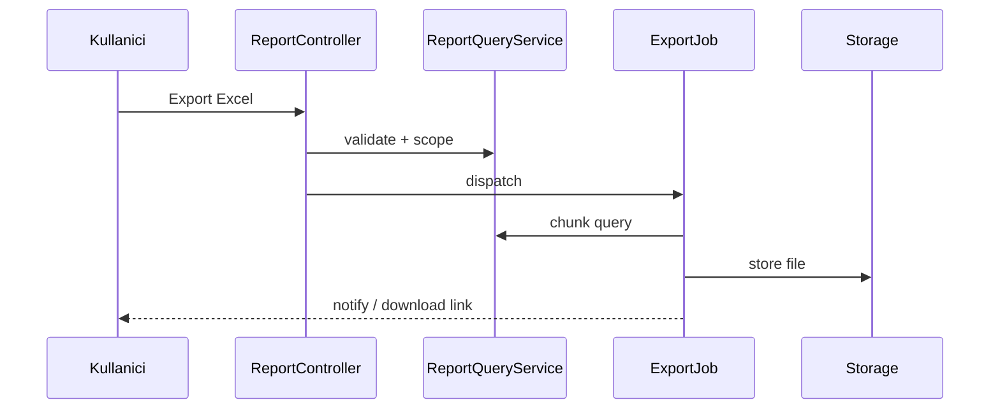

# EPIC-30B — BI / rapor katmanı ve export (tasarım notları)

İlgili epic: [ROADMAP_EPICS.md](ROADMAP_EPICS.md) → EPIC-30B.  
Referans UI pattern: [REFERANS_SITE_NOTLARI.md](../REFERANS_SITE_NOTLARI.md).  
İlgili: [EPIC_30A_BILLING_SAAS.md](EPIC_30A_BILLING_SAAS.md) (kullanım kotası raporları).

## 1. Amaç

Operasyon ve yönetim için **tarih aralıklı** raporlar, **KPI kartları**, liste + filtre + kolon seçimi + sayfalama; çıktı **Excel / PDF**.

Kapsam önceliği (Loji referansı ile uyumlu):

- Teslim edilen siparişler
- İptal edilen siparişler
- Kurye / restoran bazlı özet (ikinci aşama)

## 2. Mevcut kod çıkış noktaları

| Panel | Örnek |
|-------|--------|
| Firma | `Firm\ReportController`, `resources/views/firm/reports.blade.php` (tarih filtreleri mevcut) |
| Admin | `Admin\ReportController`, `admin/reports.blade.php` |
| Restoran | `Restaurant\ReportController` |

EPIC-30B bu yapıyı **genişletir**; yeni “rapor motoru” tekrarını minimumda tutmak için ortak sorgu builder veya servis önerilir.

## 3. KPI tanımları (v1)

**Teslim edilenler** (`status = delivered`, tarih alanı ürün kararı — mevcut firm raporlarında `updated_at` ile uyum):

- Paket sayısı (adet)
- Toplam satış tutarı (`sum(total_price)`)
- Paket ortalama tutarı (toplam / adet)

**İptal edilenler** (`status = cancelled`):

- Aynı üç metrik (veya sadece adet + iptal nedeni varsa — `meta` genişletmesi).

Filtreler (referans menü): restoran, kanal (gelecekte `orders.channel`), kurye, ödeme yöntemi.

## 4. Performans

- **Küçük hacim:** doğrudan SQL + indeksler (`firm_id`, `status`, `created_at` / `updated_at`).
- **Büyük hacim:** günlük `report_daily_firm` özet tablosu (ETL job): `firm_id`, `date`, `delivered_count`, `delivered_revenue`, `cancelled_count`, …
- Ağır raporlar: async “export job” + dosya indirme linki.

## 5. Export

| Format | Teknoloji adayı |
|--------|------------------|
| Excel | `maatwebsite/excel` veya CSV + `.xlsx` üreten hafif paket |
| PDF | `barryvdh/laravel-dompdf` veya harici şablon |

**Güvenlik:** Export isteği `firm_id` scope; geçici dosya URL’si imzalı ve süreli.

## 6. Ortak liste bileşeni (hedef mimari)

- Arama, filtre, kolon seçimi, sayfalama — [REFERANS_SITE_NOTLARI.md](../REFERANS_SITE_NOTLARI.md) ile aynı dil.
- Blade partial veya Livewire/Vue (ürün kararı); MVP’de mevcut Tailwind/Blade ile kopya azaltma.

## 7. Kabul kontrol listesi

- [ ] Teslim / iptal raporları tarih aralığı ile tutarlı (timezone: `Europe/Istanbul`).
- [ ] Firma yalnızca kendi verisini görür; admin tümünü veya seçili firmayı.
- [ ] Excel export en az N satırda doğrulanmış örnek fixture ile test.
- [ ] PDF en az bir şablon (logo + tablo) ile üretilir.

## 8. Akış (özet export)

