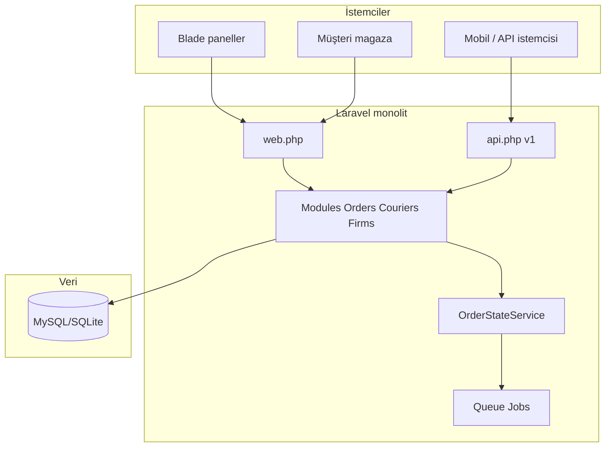

# Kurye platformu: mimari analiz ve rekabet stratejisi

Tüm dokümanların indeksi: [README.md](README.md).

Bu belge, ürün ve satış ekiplerinin paylaşabileceği tek kaynak özetidir. Kaynak: platform strateji planı (Cursor plan çıktısı); depo içi yollar göreli verilmiştir.

---

## Paylaşım kontrol listesi (Faz 0–1)

Ürün / satış ile toplantıda netleştirmek için:

- [x] **Faz 0:** `routes/tenant.php` ile `composer.json` uyumu — **Teknik karar (repo):** Stancl paketi yok; `routes/tenant.php` yalnızca açıklayıcı placeholder (yüklenmiyor). Asıl kiracı modeli domain + `firm_id`.
- [ ] **Faz 0:** Ödeme gateway seçimi (hangi sağlayıcı, pilot firma)
- [ ] **Faz 0:** Dış API sürümleme ve destek politikası (v1 süresi, kırıcı değişiklik)
- [ ] **Faz 1:** İlk pilot şehir / firma ve başarı metrikleri (ortalama teslim süresi, atama süresi)
- [ ] **Faz 1:** Harita sağlayıcısı ve bütçe (Google Maps, Mapbox, yerel)
- [ ] **Faz 1:** Müşteri teslim takip linkinde KVKK metni ve konum gizliliği kuralları

---

## Kaynak kod özeti

- [composer.json](../composer.json) — Laravel 12, Sanctum
- [routes/web.php](../routes/web.php) — admin / firma / restoran / kurye / mağaza
- [routes/api.php](../routes/api.php) — v1: restoran listesi, siparişler, kurye konum ve durum
- [app/Modules/](../app/Modules/) — Orders, Couriers, Firms, Restaurants, Users, Notifications, Payments
- [app/Modules/Orders/Services/OrderStateService.php](../app/Modules/Orders/Services/OrderStateService.php)
- [app/Http/Middleware/ResolveFirmFromDomain.php](../app/Http/Middleware/ResolveFirmFromDomain.php)

**Not:** [routes/tenant.php](../routes/tenant.php) geçmişte Stancl şablonu içeriyordu; artık **yüklenmeyen** bir placeholder ve açıklama notu. Gerçek kiracı ayrımı **domain + `firm_id` scoped veri** ile yapılıyor.

---

## 1. Mevcut sistem mimarisi analizi

**Katmanlar**

- **Sunum:** Blade + Vite; dört operasyon paneli (admin, firma, restoran, kurye) + müşteri tarafı `magaza` (firma domain’inden çözülür).
- **Uygulama:** Inertia yok; klasik MVC. Yetkilendirme: `auth` + rol middleware’leri (`EnsureAdminAuthenticated`, `EnsureFirmAdminAuthenticated`, vb.).
- **Domain:** Modüler klasör yapısı (`App\Modules\*`) — Order, Courier, Restaurant, Firm, User, Notification, Payment (arayüz + `NullPaymentGateway`).
- **API:** REST v1, Sanctum; kurye için aktif sipariş, durum güncelleme, konum gönderimi; müşteri/restoran için sınırlı uçlar.
- **Arka plan işler:** Kuyruk (`CreateInAppNotificationJob` vb.); panel içi bildirimler.
- **Çok kiracılılık (fiili):** `Firm` kaydında `domain` + `FirmContext`; mağaza rotaları `firm.resolve` ile firma bağlamına alınır. Tam veritabanı kiracılığı (DB/schema per tenant) kodda tam bağlanmamış.

**Güçlü yanlar:** Net sipariş yaşam döngüsü ve geçmiş; firma–restoran–kurye ayrımı; kampanya/kupon; API omurgası; domain bazlı markalı mağaza.

**Zayıf / riskli yanlar (ölçek için):** Otomatik dispatch yok; harita/operasyon ekranı yok; ödeme gerçek gateway’e bağlı değil; API yüzeyi rakip mobil/entegrasyon ihtiyaçlarına göre dar.

---

## 2. Eksik modüller (ürün blokları)

| Modül | Açıklama |
|--------|-----------|
| **Dispatch / atama motoru** | Kurallı veya skorlu otomatik kurye atama, kapasite ve bölge kısıtları. |
| **Canlı operasyon / harita** | Kurye + sipariş + restoran pinleri, filtreler, müdahale (yeniden atama). |
| **Entegrasyon hub** | Yemek agregatörleri, POS, muhasebe, e-Fatura, SMS/WhatsApp sağlayıcıları. |
| **Müşteri teslim takibi** | Paylaşılabilir link, ETA, harita (SMS/push). |
| **Vardiya ve İK-lite** | Mesai, mola, devamsızlık, performans KPI. |
| **Fiyatlandırma ve faturalama (SaaS)** | Paketler, abonelik, kullanım, fatura. |
| **Gelişmiş raporlama / BI** | OLAP benzeri paneller, dışa aktarma, zaman serisi. |
| **Webhook ve ortak API** | Ortakların sipariş/durum dinlemesi; API anahtarları ve kota. |
| **Uyumluluk** | KVKK (açık rıza, silme, log), denetim izi. |

---

## 3. Eksik özellikler (rakip ekseninde)

**Loji** (loji.app): Otomatik atama, rota/paket optimizasyonu, çoklu şehir/ekip (alt team), agregatör entegrasyonları, canlı takip, operasyon paneli — bu projede **otomatik atama, harita operasyonu, agregatör entegrasyonları ve çok katmanlı ekip yönetimi** açıkça eksik.

**JaviKurye** (javikurye.com): Operasyon ekranı, ısı haritası, rota, vardiya/mola, prim, güçlü mobil vurgu — bu projede **vardiya/mola/prim, ısı haritası, yerel mobil uygulama deneyimi (şu an web + ince API)** eksik.

**Kuryem / Tesliman** (genel pazar): Genelde **marka bilinirliği, yerel destek, fiyat, hazır entegrasyon listesi** ile öne çıkar; teknik olarak benzer boşluklar: **hazır entegrasyon kataloğu, 7/12 destek vaadi, referans müşteri hikâyeleri**.

---

## 4. Geliştirme roadmapi (öneri)

**Faz 0 — Temizlik (1–2 hafta):** `tenant.php` / provider uyumu veya kaldırma; ödeme arayüzünü tek gerçek gateway ile somutlaştırma kararı; API sürümleme politikası.

**Faz 1 — Operasyon çekirdeği (2–3 ay):** Harita tabanlı operasyon ekranı (firma); manuel yeniden atama; temel **skorlu otomatik atama** (mesafe, yük, bölge); müşteri **teslim takip linki**; webhook + API anahtarı (dar kapsam).

**Faz 2 — Entegrasyon (3–6 ay):** En az bir agregatör veya POS pilotu; SMS; e-arşiv/e-Fatura için entegrasyon planı; kuyruk dayanıklılığı ve idempotent webhook işleme.

**Faz 3 — SaaS ve ölçek (6–12 ay):** Paket/fiyatlandırma; çok kiracılı veri stratejisi netleştirme; gözlemlenebilirlik (APM, log); yük testi; mobil uygulama veya PWA önceliği.

---

## 5. Ölçeklenebilir SaaS mimarisi önerisi

- **Kiracı modeli:** Kısa vadede mevcut **shared DB + `firm_id` + sıkı scope** yeterli; büyümede **schema-per-tenant** veya **DB-per-tenant** (yüksek izolasyon) değerlendirilir. `stancl/tenancy` tekrar eklenirse merkezi domain ve tenant route’ları bilinçli tasarlanmalı.
- **Async:** Sipariş ve bildirimler için ayrı kuyruk; gecikme duyarlı işler için Redis + horizon; webhook gönderimi retry ile.
- **Okuma ölçeklemesi:** Raporlar için replika veya özet tablolar (materialized views / nightly aggregate).
- **Konum:** Yüksek hacimde konum yazımını **append-only log** veya time-series dostu depoda tutma; panelde seyrekleştirme.
- **Güvenlik:** API rate limit (mevcut throttle genişletilir), WAF, secrets vault; kiracı başına anahtar.
- **Dağıtım:** Container + blue-green; ortam başına config; feature flag (LaunchDarkly benzeri veya basit DB flag).

---

## 6. Türkiye pazarına uygun rekabet stratejisi

- **Kama özellik:** “Tek ekranda operasyon + güvenilir otomatik atama + şeffaf SLA” — geniş entegrasyondan önce **bir şehirde mükemmel operasyon** hikâyesi.
- **Entegrasyon sırası:** En çok talep gören 1–2 kanal (ör. Trendyol Yemek / Yemeksepeti veya bölgesel POS) ile **referans restoran** kazanın.
- **Fiyatlandırma:** Rakiplerin “kurulum yok / şeffaf fiyat” mesajına karşı **net koltuk başı veya sipariş başı üst sınır** + deneme süresi.
- **Uyumluluk ve güven:** KVKK sayfası, veri işleme sözleşmesi, yerinde destek (İstanbul/Ankara/İzmir) vaadi.
- **Kanal:** WhatsApp Business ile satış ve onboarding; YouTube kısa eğitimler; restoran dernekleri ile pilot.

---

## 20 ileri seviye özellik önerisi

1. **Skor tabanlı otomatik kurye atama** (mesafe, bekleyen sipariş, bölge, puan).
2. **Çoklu durak / batch teslimat** ve rota sıralama.
3. **Canlı harita operasyon merkezi** (filtre, müdahale, geçmiş konum).
4. **Sipariş ısı haritası** (yoğunluk ve gecikme riski).
5. **Müşteri teslim takip sayfası** (ETA, kurye konumu, gizlilik modları).
6. **Agregatör entegrasyon katmanı** (sipariş çekme, durum geri yazma, stok senkronu).
7. **POS / ön muhasebe entegrasyonu** (üçüncü parti veya standart export).
8. **Vardiya, mola ve çevrimiçi/çevrimdışı durumu** (kurye uygulamasından).
9. **Prim ve ceza kuralları** (SLA, teslim süresi, iptal oranı).
10. **Dinamik teslimat ücreti** (mesafe, yoğunluk, hava, kampanya).
11. **Bölge ve kapasite kuralları** (max aktif sipariş, geo-fence).
12. **Çoklu depo / ghost kitchen** ve restoran grupları.
13. **Webhook + ortak API portalı** (imza, retry, sürüm).
14. **Gelişmiş raporlar ve Excel/PDF export** (KPI, kurye karşılaştırma).
15. **Bildirim omurgası:** SMS, e-posta, push (FCM), WhatsApp şablonları.
16. **KVKK ve denetim günlüğü** (kim neye erişti, veri silme talebi).
17. **e-Fatura / e-Arşiv** hazırlığı veya entegrasyon.
18. **Çok dil ve çok para birimi** (SaaS için).
19. **Özelleştirilebilir sipariş durumları** ve onay akışları (franchise).
20. **Yapay zekâ asistanı:** gecikme tahmini, chatbot ile sipariş sorgusu, doğal dil rapor.

---

## Özet

Kod tabanı güçlü bir **çekirdek sipariş ve çok rollü panel** sunuyor; rakiplerin ayırt edici olduğu **otomasyon (atama/rota), canlı operasyon, mobil derinlik ve entegrasyon ağı** ürünleştirilmemiş durumda. Stratejik olarak önce operasyon ve atama, sonra entegrasyon ve SaaS faturalama ile ölçek en düşük riskli yol olarak önerilir.
